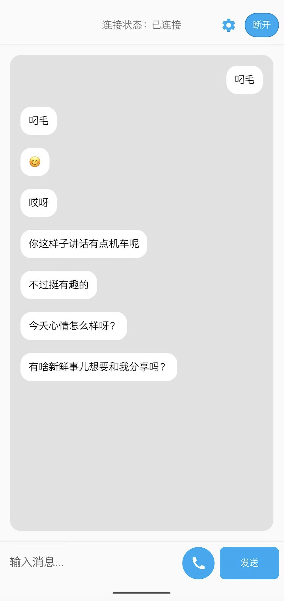

# 小智AI助手 Android客户端

一个基于WebSocket的Android语音对话应用,支持实时语音交互和文字对话。

<p align="center">
  
</p>

## 功能特点

- 实时语音电话对话
- 文字消息交互
- 波形动画显示
- 支持Opus音频编解码
- 支持Token认证
- 自动重连机制
- 深色/浅色主题适配
- 随时打断，随时说话

## 系统要求

- Android 11.0 (API 30)及以上
- 需要麦克风权限
- 需要网络连接

## 构建说明

1. 克隆项目:
```bash
git clone https://github.com/TOM88812/xiaozhi-android-client.git
```

2. 使用Android Studio打开项目

3. 构建项目:
   - 点击 Build -> Build Bundle(s) / APK(s) -> Build APK(s)
   - 或在命令行执行: `./gradlew assembleDebug`

4. 编译输出:
   - Debug APK位置: `app/build/outputs/apk/debug/app-debug.apk`
   - Release APK位置: `app/build/outputs/apk/release/app-release.apk`

## 配置说明

1. 服务器配置
   - 在设置页面配置WebSocket服务器地址
   - 默认地址: `ws://localhost:9005`

2. Token认证
   - 可选择是否启用Token认证
   - 在设置页面配置Token

## 技术栈

- WebSocket: Java-WebSocket 1.5.4
- 音频编解码: Opus

## 开发环境

- Android Studio
- JDK 11